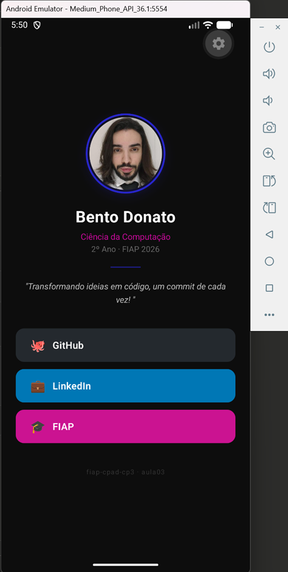
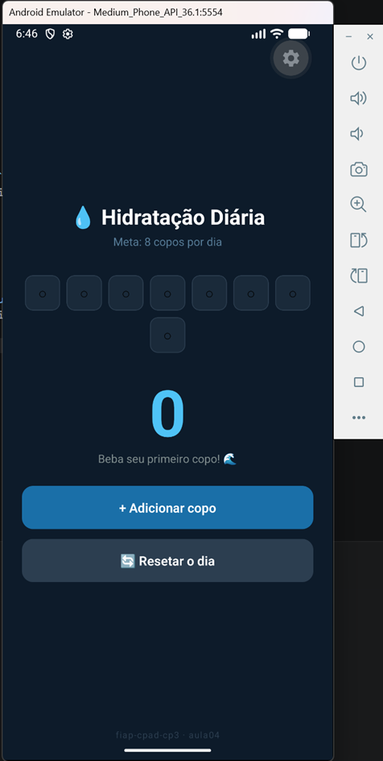
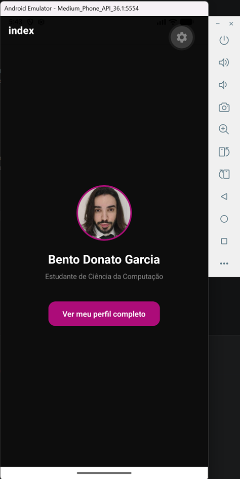
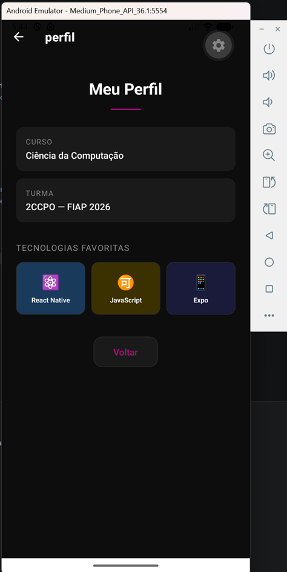
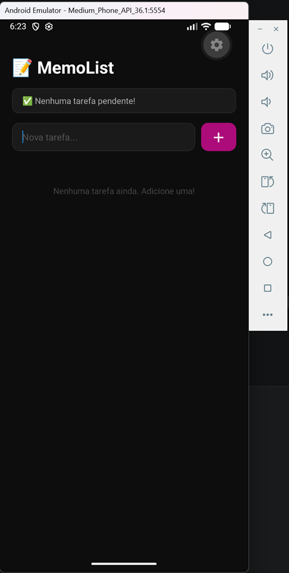
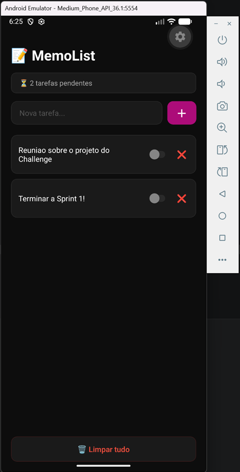

# fiap-cpad-cp3

**Aluno:** Bento Donato Garcia
**RM:** 561621
**Turma:** 2CCPO

---

## Exercícios

| Aula | Exercício | Pasta |
|------|-----------|-------|
| 03 | Cartão de Visita Digital | [aula03-cartao-visita](./aula03-cartao-visita/) |
| 04 | Contador de Hidratação | [aula04-contador-hidratacao](./aula04-contador-hidratacao/) |
| 05 | Meu Perfil | |
| 06 | MemoList |  |
| 07 | Mini Loja |  |
| 09 | Cadastro Completo |  |

---

## Como rodar qualquer exercício localmente

```bash
git clone https://github.com/bentodonato/fiap-cpad-cp3
cd fiap-cpad-cp3/aula03-cartao-visita
npm install
npx expo start
```

## Troque `aula03-cartao-visita` pelo nome da pasta do exercício desejado.
## Com o emulador Android aberto no Android Studio, pressione `a` no terminal para abrir no emulador.

---

## Aula 03 — Cartão de Visita Digital

Eu desenvolvi o app com React Native + Expo, que funciona como um cartão de visita digital interativo, no estilo mini Linktree personalizado. Foi feita a utilização de componentes como `View`, `Text`, `Image` e `TouchableOpacity`, além de `Linking` para abrir URLs externas diretamente pelo app. A estilização foi feita inteiramente com `StyleSheet`, explorando cores, bordas arredondadas e sombras para criar um visual interessante, com tema escuro. Os dados do perfil (nome, curso, frase e links) foram organizados em um objeto JavaScript, simulando como seriam consumidos a partir de uma API futuramente.




## Aula 04 — Contador de Hidratação

Aqui eu criei uma tela para o app de rastreamento de consumo de água com meta diária de 8 copos. Usei `useState` para controlar o contador de copos, `useEffect` para detectar quando a meta diária é atingida e alterar o estado da mensagem de conquista. Os botões foram feitos com `TouchableOpacity` e toda a estilização usa `StyleSheet` com tema escuro e indicadores visuais de progresso.




## Aula 05 — Layout, Telas & Navegação

Nesse exercício eu criei o mini-app com 2 telas e navegação entre elas usando Expo Router. Tem a estrutura de rotas baseada em arquivos dentro da pasta app/, configuração do Stack Navigator via _layout.tsx e navegação programática com useRouter. A tela de perfil utiliza Flexbox com flexDirection: 'row' para exibir os cards de tecnologias lado a lado e o botão de voltar usa router.back() para retornar à tela anterior.





## Aula 06 — MemoList: Lista de Tarefas com Persistência

Nesse exercício, criei o app de lista de tarefas com persistência de dados usando AsyncStorage. Foi usado a separação de componentes criando o TarefaItem.js na pasta components/, o uso do Switch para marcar tarefas como concluídas com texto riscado via textDecorationLine, e FlatList para renderizar a lista. O useEffect foi utilizado em duas coisas: carregar os dados salvos ao abrir o app e para salvar automaticamente no AsyncStorage sempre que a lista é alterada, garantindo persistência entre sessões.


